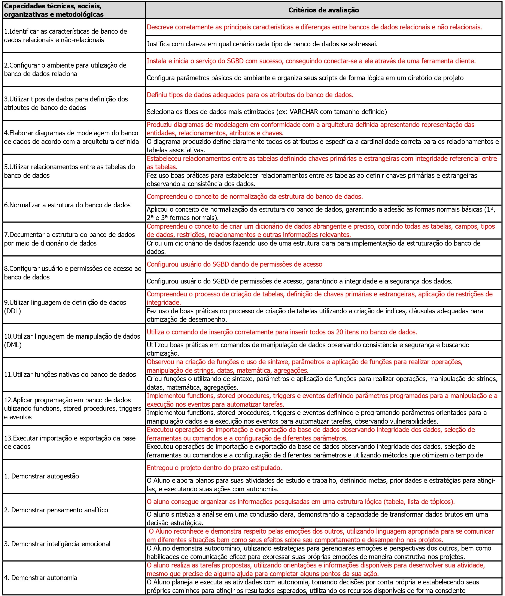

# 👨🏻‍💻 Técnico em Desenvolvimento de Sistemas - TURMA DEV-Clarios
## 🤖 BANCO DE DADOS
|Objetivo:|
|-|
|Desenvolver capacidades técnicas e socioemocionais relativas à criação da estrutura para armazenamento, manipulação e persistência de dados.|

## Horários

- Carga Horária (**Mínimo 75%** de Frequência)

|Modalidade|Horas|Aulas|
|-|-|-|
|Presencial|75 horas|100 aulas|

## Critérios de avaliação (Críticos e Desejaveis)

- Notas (Baseada em requisitos Críticos e desejáveis. **Mínimo 50** de 0 a 100)

### Composição da Nota

**CC: Critério Crítico**  
CD: Critério Desejável

|DESEMPENHO|NOTA| |DESEMPENHO|NOTA|
|-|:-:|:-:|:-:|:-:|
|17 CC + 17 CD|100| |17 CC|50|
|17 CC + 16 CD|95| |16 CC|45|
|17 CC + 15 CD|90| |15 CC|40|
|17 CC + 13 a 14 CD|85| |13 a 14 CC|35|
|17 CC + 11 a 12 CD|80| |11 a 12 CC|30|
|17 CC + 09 a 10 CD|75| |09 a 10 CC|25|
|17 CC + 07 a 08 CD|70| |07 a 08 CC|20|
|17 CC + 05 a 06 CD|65| |05 a 06 CC|15|
|17 CC + 03 a 04 CD|60| |03 a 04 CC|10|
|17 CC + 01 a 02 CD|55| |01 a 02 CC|05|

## Competências Específicas e Socioemocionais 

### Capacidades Técnicas
1. Identificar as características de banco de dados
relacionais e não-relacionais
2. Configurar o ambiente para utilização de banco
de dados relacional
3. Utilizar tipos de dados para definição dos
atributos do banco de dados
4. Elaborar diagramas de modelagem do banco de
dados de acordo com a arquitetura definida
5. Utilizar relacionamentos entre as tabelas do
banco de dados
6. Normalizar a estrutura do banco de dados
7. Documentar a estrutura do banco de dados por
meio de dicionário de dados
8. Configurar usuário e permissões de acesso ao
banco de dados
9. Utilizar linguagem de definição de dados (DDL)
10. Utilizar linguagem de manipulação de dados
(DML)
11. Utilizar funções nativas do banco de dados
12. Aplicar programação em banco de dados
utilizando functions, stored procedures, triggers
e eventos
13. Executar importação e exportação da base de
dados

### Capacidades Socioemocionais
1. Demonstrar autogestão
2. Demonstrar pensamento analítico
3. Demonstrar inteligência emocional
4. Demonstrar autonomia

## Conhecimentos:
- 1. Sistema Gerenciador de Banco de Dados (SGBD)
	- 1.1. Definição
	- 1.2. Tipos
		- 1.2.1.Relacional
		- 1.2.2.Não relacional
	- 1.3. Características
	- 1.4. Estrutura
		- 1.4.1.Tabela
		- 1.4.2.Registro
		- 1.4.3.Campo
		- 1.4.4.Tipos de dados
	- 1.5. Instalação e configuração
- 2. Modelo relacional
	- 2.1. Modelagem
		- 2.1.1.Dicionário de dados
		- 2.1.2.Modelo Entidade Relacionamento - MER
		- 2.1.3.Diagrama Entidade Relacionamento - DER
		- 2.1.4.Formas normais
	- 2.2. SQL (Structured Query Language)
	- 2.3. DCL (Data Control Language)
		- 2.3.1.GRANT
		- 2.3.2.REVOKE
	- 2.4. DDL (Data Definition Language)
		- 2.4.1.CREATE DATABASE
		- 2.4.2.DROP DATABASE
		- 2.4.3.USE
		- 2.4.4.CREATE TABLE
		- 2.4.5.ALTER TABLE
		- 2.4.6.DROP TABLE
		- 2.4.7.CREATE INDEX
		- 2.4.8.DROP INDEX
	- 2.5. Migração de dados
		- 2.5.1.Exportação de dados
		- 2.5.2.Importação de dados
	- 2.6. DML (Data Manipulation Language)
		- 2.6.1.INSERT
		- 2.6.2.UPDATE
		- 2.6.3.DELETE
		- 2.6.4.SELECT
	- 2.7. Operadores
		- 2.7.1.Aritméticos
		- 2.7.2.Relacionais
		- 2.7.3.Lógicos
		- 2.7.4.Auxiliares
	- 2.8. Funções
		- 2.8.1.Data e hora
		- 2.8.2.Matemáticas
		- 2.8.3.String
		- 2.8.4.De agregação
	- 2.9. Agrupamento de dados (GROUP BY)
	- 2.10. União de dados (UNION)
	- 2.11. Associação de tabelas
		- 2.11.1. WHERE
		- 2.11.2. CROSS JOIN
		- 2.11.3. INNER JOIN
		- 2.11.4. OUTER JOIN
		- 2.11.5. LEFT
		- 2.11.6. RIGTH
	- 2.12. Subconsultas
		- 2.12.1. IN e NOT IN
		- 2.12.2. ALL e ANY
	- 2.12.3. EXISTS
	- 2.13. TCL (transaction control language)
		- 2.13.1. COMMIT
		- 2.13.2. ROLLBACK
		- 2.13.3. SAVEPOINT
	- 2.14. VIEW
	- 2.15. STORED PROCEDURE2.16. FUNCTION
	- 2.17. TRIGGERS
	- 2.18. EVENT

## Referências básicas
- MACHADO, F.N.R, ABREU, M.P. Banco de dados – Projetos e Implementação. São Paulo: Érica, 2020.
- Carvalho, V., MySQL – Comece com o principal banco de dados Open Source do mercado. São Paulo: Casa do Código, 2018.
- Zhao, A., SQL Guia prático. São Paulo: Novatec, 2023.

## Referências complementares
- ALVES, William Pereira. Banco de Dados: Teoria e Desenvolvimento. São Paulo: Érica, 2009.
- MANZANO, José Augusto N. G. MySQL 5.5 Interativo: Guia Essencial de Orientação e Desenvolvimento. São Paulo: Saraiva, 2011.
- KORTH, Henry F.; SILBERSCHATZ, Abraham. Sistema de Banco de Dados. São Paulo: Makron Books, 1995.
- BAPTISTA, Luciana Ferreira. Linguagem SQL: Guia Prático de Aprendizagem. São Paulo: Érica, 2013.
- MANZANO, José Augusto N. G. Microsoft SQL Server 2008 Express: Interativo: Guia Prático. São Paulo: Érica, 2009
